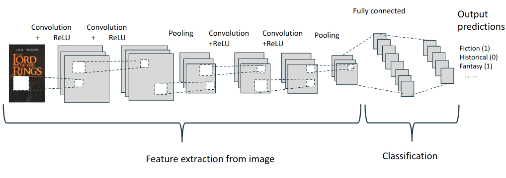
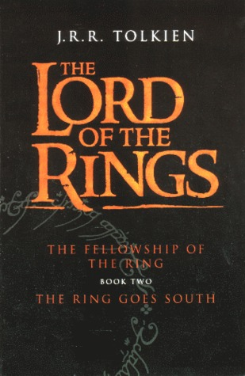

# goodreads-genre-classification

The goal of this project is to build a ML model that would be able to predict book genres by book cover and description. This is a case of multilabel classification task as each book can have a different number of tags.

## Authors

*  **Mariia Godgildieva** - [MGodgildieva](https://github.com/MGodgildieva)
*  **Anastasiia Shalygina** - [ShalyginaA](https://github.com/ShalyginaA)

## Data

Kaggle dataset ["Goodreads’ Best Books Ever"](https://www.kaggle.com/meetnaren/goodreads-best-books)

Dataset contains information on around 50K of books from Goodreads, a social cataloging website with a large database of books with reviews and ratings. The data were scraped for the books with highest ratings.

The original dataset includes 863 different genres (here used 23 most frequent only).
## Main Idea

To build separate models for genre prediction based on book description and book cover and combine results using stacking.

Text models: multilabel classifiers available in sklearn, neural networks (Keras). 

Image models: Keras, CNN, ImageDataGenerator. For the image model construction part [this code](https://medium.com/@vijayabhaskar96/multi-label-image-classification-tutorial-with-keras-imagedatagenerator-cd541f8eaf24) used.

Image model architecture:

  

#### Repository organisation

 * [code](./code)
   * [data_analysis.ipynb](./code/data_analysis.ipynb)
   * [image_model.ipynb](./code/image_model.ipynb)
   * [image_model_weights.ipynb](./code/image_model_weights.ipynb)
   * [stacking_model.ipynb](./code/stacking_model.ipynb)
   * [text_model_sklearn.ipynb](./code/text_model_sklearn.ipynb)
   * [text_model_keras.ipynb](./code/text_model_keras.ipynb)
 * [pickle_files](./pickle_files)
   * [all_books_test.pickle](./pickle_files/all_books_test.pickle)
   * [all_books_train.pickle](./pickle_files/all_books_train.pickle)
   * [test_images_valid.pickle](./pickle_files/test_images_valid.pickle)
   * [train_images_valid.pickle](./pickle_files/train_images_valid.pickle)
 * [README.md](./README.md)

## Example of the results

### Crime and Punishment
original genres: Fiction, Literature,Classics, Cultural

predicted genres: Classics,Cultural,Fiction, Literature 

  

### The Lord of the Rings
original genres:  Classics,  Fiction,  Fantasy

predicted genres: Adventure,  Classics,Fantasy, Fiction

  

